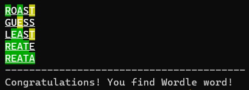

# Golang Wordle Project
---
## Description
This project which is developed in Golang language is a locally playable version of the popular word guessing game Wordle.

## How to Play
* To start the game write ```` go run .```` to terminal
* To exit the game write ```` XXXXX ```` to terminal
* Every game five letter words are selected randomly
* There are five round in the game and each round you guess five letter 
words
* Each turn (except last one) get feedback for every letter of your guess 
word according to your guess
* In the feedback: 
    * Green &#8594; letter contains and postion is correct
    * Yellow &#8594; letter contains but position is wrong
    * Non-color &#8594; letter doesn't contains
* If you don't know the Wordle word for 5 rounds, it's game over.

**Example:**



## How It Works
- Random number are generated for selecting random words in word list
- Select the Wordle word and request input as five letter word from user
- Create maps for storing letters and index of letter for guess word and Wordle word
- Find intersections and differences of each letter in the guess word between Wordle word and guess word
- Store these values another map to compare indexes of both words
- According to containing cheking and position checking, create feedback for each letter
- Print feedback and continue for next round

## Thanks
- Property Finder
- Team of Property Finder Go Bootcamp
- Patika Dev